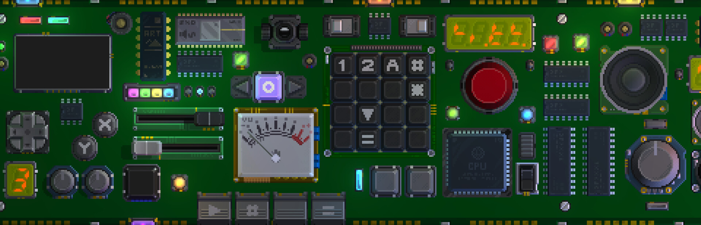

# Retro Gadgets TypeScript Template

---

A template for building [Retro Gadgets][1] in TypeScript. This template gives you the most minimal setup to start developing.

## Getting Started

1. Clone the repository or [create a new one from this template][2].  
  `git clone https://github.com/DarkMio/retro-gadgets-template`
2. Open the directory  
  `cd retro-gadgets-template`
3. Install the dependencies  
  `npm install`
4. Run the interactive compiler  
  `npm run dev`
5. Develop your code! :tada:
6. Copy/Paste or import `compiled/CPU.lua` into [Retro Gadgets][1]

[1]: https://store.steampowered.com/app/1730260/Retro_Gadgets/
[2]: https://docs.github.com/en/repositories/creating-and-managing-repositories/creating-a-repository-from-a-template